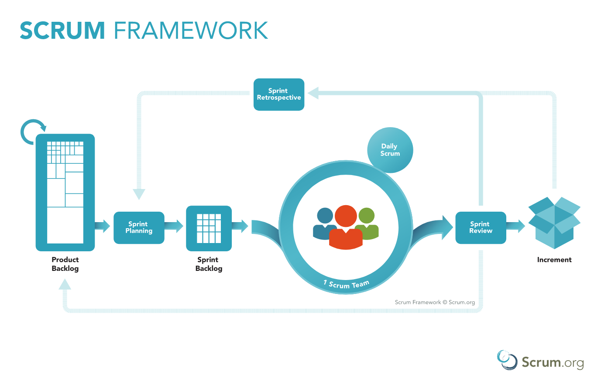
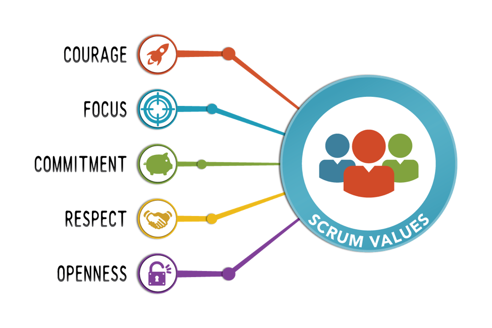

# 📚 Scrum Developer Certification Preparation 🎓
📚 Preparation for the Professional Scrum Developer Certification 🎓

Link: https://www.scrum.org/professional-scrum-developer-certification

## What is Scrum? ❓

**Scrum** is a framework for project management that emphasizes teamwork, accountability and iterative progress toward a well-defined goal. The framework begins with a simple premise: Start with what can be seen or known. After that, track the progress and tweak as necessary. The three pillars of Scrum are **transparency**, **inspection** and **adaptation**. 
The framework, which is often part of **Agile** software development, is named for a rugby formation. Everyone plays a role. When it comes to product development, **Scrum roles** include **product owner**, **Scrum master** and **Scrum development team**. 

**Product owner**: This team member serves as the liaison between the development team and its customers. The **product owner** is responsible for ensuring expectations for the completed product have been communicated and agreed upon. 

**Scrum master**: This team member serves as a facilitator. The **Scrum master** is responsible for ensuring that Scrum best practices are carried out and the project is able to move forward. 

**Scrum development team**: This is a group that works together for creating and testing incremental releases of the final product.

## The Scrum process 📅

The **Scrum process** encourages practitioners to work with what they have and continually evaluate what is working and what is not working. **Communication**, which is an important part of the process, is **carried out through meetings, called Events**. **Scrum Events** include:

**Daily Scrum**. The **Daily Scrum** is a **short stand-up meeting** that happens **at the same place and time each day**. At each meeting, **the team reviews work that was completed the previous day and plans what work will be done in the next 24 hours**. **This is the time for team members to speak up about any problems that might prevent project completion**.

**Sprint Planning Meeting**. A **Sprint** refers to the **time frame in which work must be completed**, and **it's often 30 days**. **Everyone participates in setting the goals**, and **at the end**, **at least one increment -- a usable piece of software -- should be produced**.

**Sprint Review**. **This is the time to show off the increment**.

**Sprint Retrospective**. A **Sprint Retrospective** is **a meeting that's held after a Sprint ends**. During this meeting, **everyone reflects on the Sprint process**. A team-building exercise may also be offered. An important goal of a Sprint Retrospective is **continuous improvement**.

## Scrum artifacts 📁

An **artifact** is **something of historical interest that deserves to be looked at again**. In **Scrum product development**, **artifacts are used to see what's been done and what is still in the queue**. **Scrum artifacts**, which include **product backlog**, **Sprint backlog**, **product increment** and **burn-down**, are useful to look at in **Sprint Planning Meetings**.

**Product backlog**. This refers to what remains on the "to be done" list.  During a product backlog grooming session, the development team works with the business owner to prioritize work that has been backlogged. The product backlog may be fine-tuned during a process called backlog refinement.

**Sprint backlog**. This is a list of tasks that must be completed before selected product backlog items can be delivered. These are divided in to time-based user stories.

**Product increment**. This refers to what's been accomplished during a Sprint -- all the product backlog items -- as well as what's been created during all previous Sprints. The product increment reflects how much progress has been made.

**Burn-down**. The burn-down is a visual representation of the amount of work that still needs to be completed. A burn-down chart has a Y axis (work) and an X axis (time). Ideally, the chart illustrates a downward trend, as the amount of work still left to do over time burns down to zero.

## Scrum values 🔤

The **three pillars of Scrum** -- **transparency**, **inspection** and **adaptation** -- are supported by **five values**: **commitment**, **courage**, **focus**, **openness** and **respect**.

**Commitment**: The team is self-directed, and all members are dedicated to completing work that has been agreed upon.

**Courage**: The team operates as a single entity and succeeds or fails together.

**Focus**: The team limits distractions and concentrates on what work needs to be done today.

**Openness**: The team is given time to gather and share what has been successful and what needs to be improved.

**Respect**: The team is composed of members who have different strengths, and each individual's strengths are respected. There is no finger-pointing when discussing how to fix what is not working.

